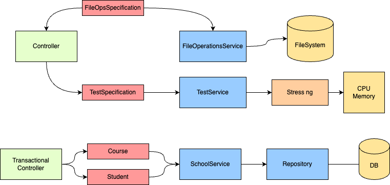

#### Design

The design of Cluster Probe follows a straightforward approach where each feature is implemented as a separate service. These services can be injected as
Spring beans into the Controller class, which acts as the REST API implementation. the use of dependency injection through Spring beans enhances code modularity
and testability. By decoupling components and providing dependencies through injection, the design promotes flexibility and makes it easier to introduce changes
or extend functionality without impacting other parts of the system.

Error handling is handled by an ErrorHandler class, which returns the
appropriate HTTP response entities with the correct status code and message. This class allows to provide a uniform approach to handling exceptions and
generating meaningful error responses. This practice improves the overall readability of the tests that will allow to better analyze the errors.

The design includes model classes, such as TestSpecification for stress-ng job specifications and FileOperationSpecification for file operations endpoints. For
transactional database tests, there is a separate controller to manage these specific cases. Additionally, a class following the Repository pattern is
responsible for saving and retrieving objects from the database. This provides a structured representation of the data being processed. This separation of data
models helps to enforce data integrity and ensures consistent handling of inputs and outputs across the application.

In summary, the Controller class receives requests along with the corresponding specification objects, which are then processed by the service layer to execute
the required logic. Errors are handled by the ErrorHandler, and the transactional database tests have their own controller and a dedicated class for database
operations.

