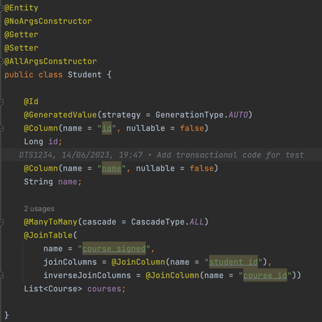

### Introduction

Cluster Probe is written in Java 17, and it uses the Spring Boot Framework.
Each feature's code is stored in its own java package.

All packages expose a service class that can be injected as a dependency to the
Controller, the REST api web layer class. Any error that has occurred during the test is handled by the ErrorHandler class that specifies an appropriate
message and returns the error response entity.


### File operations

FileOperations service is using java standard development kit libraries to implement the creation, update and the deletion for files. Those operations are
performed based on the data specified in FileSystemSpecification class object.


there is only one public method implemented for the `FileOperationsService` all the files created will be stored under the projects directory
in the 'test' folder, then the number of files will be created based on parameters specified in the specification object.


<figure>
<figcaption align="center"><em>Specification class</em></figcaption>
</figure>

If the `fileContent` parameter will be null or empty no write operations will be performed.


After all the operations are performed files and the 'test' directory are deleted:


### Stress ng

In order to implement the stress ng jobs invocation, `TestService` creates an appropiate stress ng job based on the `TestSpecification` parameters,
not all parameters are required so mostly `TestService` class implements the logic for creating the job accurately.


<hr>


<figure>
<figcaption align="center"><em>Specification class</em></figcaption>
</figure>

for each parameter in the specification there is an according mapping method in the service class that based on whether the parameter is correct or not it
creates an appropriate part of the command. There is also an option for receiving a plain command as a string, if this one is available and
the `isCommand` flag is set to `true` the rest of the parameters will be ignored.


Whenever the `durationInSeconds` parameter will not be available there is a default 24 hours value set in the `mapTestTimeCommand`:


### Transactional

In order to give the users an availability to test multiple database connections with transactional operations, a small example for the school domain have been
created. It represents a classical model of a student - course many to many relationship.

The `Student` class represents a student in the educational domain. It is annotated with `@Entity` to indicate that it is a JPA entity mapped to a database
table. The class has the following attributes:

- `id`: A unique identifier for the student, annotated with `@Id` and `@GeneratedValue` to indicate that it is the primary key and its value is automatically
  generated.
- `name`: The name of the student, annotated with `@Column` to specify the mapping to the corresponding column in the database table.
- `courses`: A many-to-many relationship with the `Course` class, representing the courses that the student is enrolled in. The relationship is defined using
  the `@ManyToMany` annotation, and the mapping is managed through a join table named "course_signed".



The `Course` class represents a course offered in the educational domain. It has similar annotations and attributes as the `Student` class:

- `id`: The unique identifier for the course.
- `name`: The name of the course.
- `students`: A bidirectional many-to-many relationship with the `Student` class. It is mapped by the `courses` attribute in the `Student` class using
  the `mappedBy` attribute of the `@ManyToMany` annotation. This establishes the inverse side of the relationship.


The database model for these entities can be visualized as follows:

```
+--------------+     +-------------------+     +------------------+
|   Student    |     |   Course          |     |   course_signed  |
+--------------+     +-------------------+     +------------------+
| id (PK)      |<--->| id (PK)           |     | student_id (FK)  |
| name         |     | name              |     | course_id (FK)   |
+--------------+     +-------------------+     +------------------+
```

The `Student` and `Course` tables represent the entities, and the `course_signed` table serves as the join table for the many-to-many relationship between them.
The `student_id` and `course_id` columns in the `course_signed` table establish the associations between students and courses.

This database model allows for a many-to-many relationship between students and courses, enabling students to be enrolled in multiple courses, and courses to
have multiple students.

In order to manipulate the database entities two different repository classes were provided.


The Spring Data JPA interfaces JpaRepository<Course, Long> and
JpaRepository<Student, Long> are part of the Spring Data JPA framework, which provides a set of
abstractions and utilities for working with relational databases using the Java Persistence API (JPA).

These interfaces provide a high-level abstraction for performing common database operations on the Course and Student entities without the need for writing
boilerplate code. Some benefits of using Spring Data JPA interfaces include:

1. Query Methods: Spring Data JPA interfaces allow you to define custom query methods by simply declaring method signatures. The framework automatically
   generates the necessary SQL queries based on the method names, reducing the need for manual query creation.
2. CRUD Operations: The interfaces provide methods for performing CRUD (Create, Read, Update, Delete) operations on the entities. This eliminates the need to
   manually write SQL statements or implement these operations yourself.
3. Transaction Management: The interfaces integrate with Spring's transaction management capabilities, ensuring that database operations are performed within a
   transactional context.

Especially the third feature is important from the perspective of this work, as it allows us to test how multiple transactional operations will work on the
system.

Both repositories are used in a SchoolService class. The SchoolService class is a Spring service component that provides business logic and acts as an
intermediary between the controller layer and the data access layer (repositories) in the application.
It exposes methods for creating students and courses (`createStudent` and `createCourse`). These methods utilize the respective
repository's `save` method to persist the entities in the database. The getStudents, getCourses, and getStudentsForCourse methods utilize the repository's query
methods to retrieve entities from the database. The findAll method fetches all students or courses, while findById retrieves a specific student or course based
on the provided ID. Spring manages transactions implicitly for the service methods. Each method operates within a transactional context, ensuring data
consistency and integrity.

