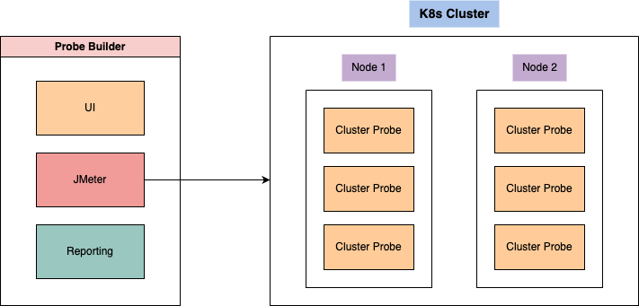

### Introduction

Welcome to the documentation of Cluster Probe and Probe Builder. This documentation provides comprehensive information and guidance on the Cluster Probe and
Probe Builder projects, which are software packages designed for testing scalability and performance in Kubernetes clusters. The main objective of these
projects is to create a software-based solution for testing typical cloud service use cases within the context of
the [reCluster](https://github.com/carlocorradini/reCluster) project, a self-aware cloud
orchestration system.

Cluster Probe and Probe Builder offer a robust and user-friendly solution for testing the capabilities and limits of Kubernetes clusters. They enable
application developers, system administrators, and testers to assess the performance, resilience, and efficiency of their cluster deployments.

Cluster Probe allows users to conduct thorough performance tests by simulating real-world scenarios and evaluating the cluster's response under various
workloads. This tool provides valuable insights into the system's capacity, identifies bottlenecks, and assesses scalability potential. On the other hand, Probe
Builder , complements Cluster Probe by providing a convenient way to create custom test cases and scenarios. It utilizes [JMeter's](https://jmeter.apache.org/)
Java API to generate and control the load based on the specified input parameters. This allows users to define specific test criteria and performance goals,
enabling fine-grained
control over the testing process.

The documentation is structured to cover the requirements, architecture, implementation, testing methodologies, API specifications, and user guidance for both
Cluster Probe and Probe Builder. Whether you are new to these projects or seeking advanced configuration options, this documentation serves as a comprehensive
resource for effectively utilizing these testing tools.

Users are invited to explore the documentation and leverage the capabilities of Cluster Probe and Probe Builder to ensure the optimal performance and
reliability of their Kubernetes clusters. This documentation aims to provide the necessary guidance for users to effectively utilize these testing tools.

### Requirements and Dependencies

Both projects, Cluster Probe and Probe Builder, are developed using the Java programming language. Familiarity with containerization concepts and Docker is
required. Additionally, code snippets and examples will incorporate Kubernetes concepts. To run the local examples, ensure you have the following dependencies
installed:

- [JDK 17](https://www.oracle.com/java/technologies/downloads/): Java Development Kit version 17.
- [Docker](https://www.docker.com/get-started): Containerization platform for building and managing containers.
- [Minikube](https://minikube.sigs.k8s.io/docs/start/): Lightweight Kubernetes implementation for local testing and development.
- [Git](https://git-scm.com/downloads): Version control system for code repositories.
- [Postman](https://www.postman.com/downloads/): API development and testing tool (recommended for testing the API endpoints).

Please ensure that you have the appropriate versions of these dependencies installed and configured correctly before proceeding with the projects.

Note: Although Probe Builder is based on JMeter, it is not necessary to have in-depth knowledge of JMeter to utilize its basic functionalities. However, it is
required to have JMeter installed. You can download JMeter from the official [JMeter download page](https://jmeter.apache.org/download_jmeter.cgi).

Additionally, a GitHub account is recommended to access the code repositories and version control features.

By having the above dependencies set up properly, you will be ready to explore and utilize the features and functionalities of Cluster Probe and Probe Builder
effectively.

### Key features

Cluster Probe and Probe Builder are designed to provide a system for defining and executing test loads based on a set of common and identified use cases. These
use cases encompass various scenarios such as long-lasting intense CPU operations, file system operations, JSON data payloads, and file uploads.

Probe Builder offers a user-friendly interface that enables users to specify these use cases and generate JMeter test plans. These test plans are executed and
loaded onto a designated Kubernetes (k8s) cluster. After the tests are performed, Probe Builder collects the data and generates reports in the form of plots and
CSV files. These reports provide valuable insights into the performance of the tested cluster.

Cluster Probe, on the other hand, functions as a container running within k8s pods. It implements a REST API service capable of receiving different use cases,
as mentioned earlier. For instance, it can handle CPU load scenarios using stress-ng or perform file operations. The diagram below illustrates the overall
architecture and interaction between the components.

You can find more detailed information about both of the projects in the following sections [probe-builder](../probe-builder/requirements.md)
, [cluster-probe](../cluster-probe/requirements.md)