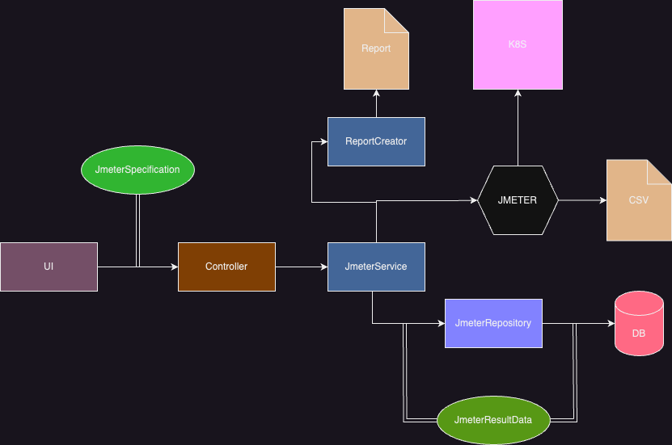

#### Design

The design of the Probe Builder is geared toward providing a user-friendly tool designed to streamline the creation and reporting of JMeter service tests,
specifically tailored for the integration with the Cluster Probe software running in a Kubernetes cluster.

The UI allows users to effortlessly configure JMeter tests by communicating with the Spring
Boot REST API Controller, which then delegates tasks to the JMeter Service.

The JMeter Service interacts with JMeter using the JMeter Java API, executing the specified tests and generating CSV files containing
test data. After test completion, the JMeter Service interacts with the JMeter Repository and the Report Creator.

The JMeter Repository stores test-related information, while the Report Creator generates informative plots for easy test result analysis. Data is passed by
through different components with the JmeterResultData and JMeterSpecification classes, thanks to that data exchange between different
layers is well organized and cohesive.

In designing Probe Builder, the focus was put on modularity and simplicity by ensuring clear separation of concerns and well-defined architectural boundaries.
This approach promotes code usability and fosters a more organized workflow. By leveraging JMeter's Java API, Probe Builder integrates with JMeter, enabling the
tool to leverage JMeter's testing capabilities for
flexible and scalable testing scenarios.

