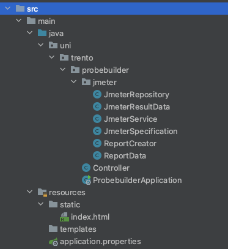

## Implementation

### Introduction

ProbeBuilder simillary as ClusterProbe is written in [Java 17](https://www.oracle.com/java/technologies/javase/jdk17-archive-downloads.html), and it also uses
the [Spring Boot Framework](https://spring.io/projects/spring-boot).

More than that however there are few dependencies that are worth mentioning regarding the implementation part of the probe builder:

- JMeter Java API: Used for creating and executing load tests within the application.
- Tablesaw: Employed for data manipulation and analysis in a tabular format.
- Maven: The build tool utilized for managing dependencies and project build processes.
- Vanilla JavaScript and HTML: Used to build a simple yet effective frontend for the application.

The main server side code is implemented in the jmeter package that stores all the important classes connected with the jmeter integration as well as reporting
and test results data management.

### JmeterService

#### JmeterRepository

### Report Creator

### Controller